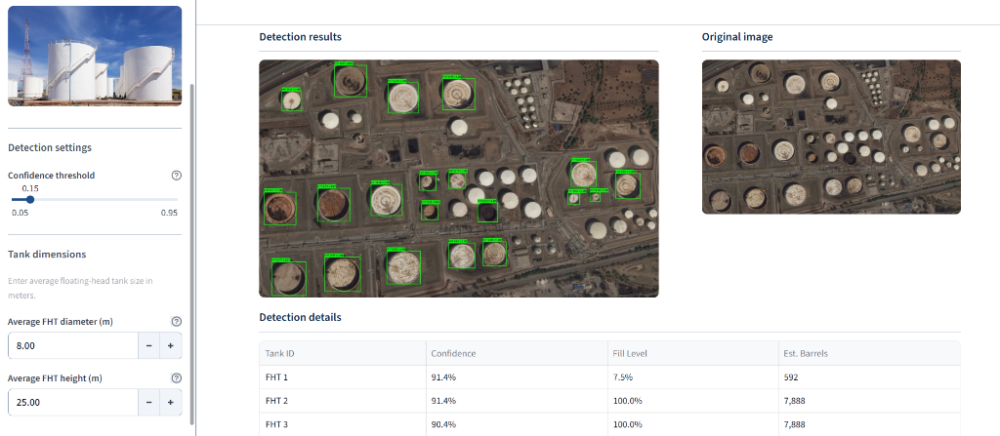
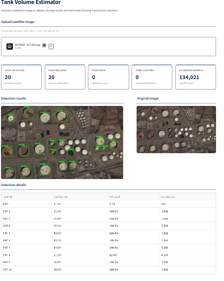
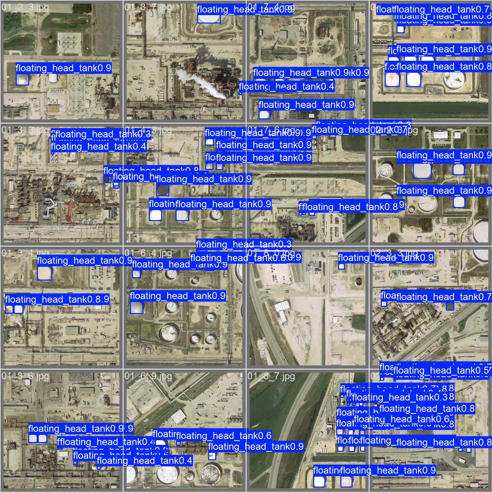
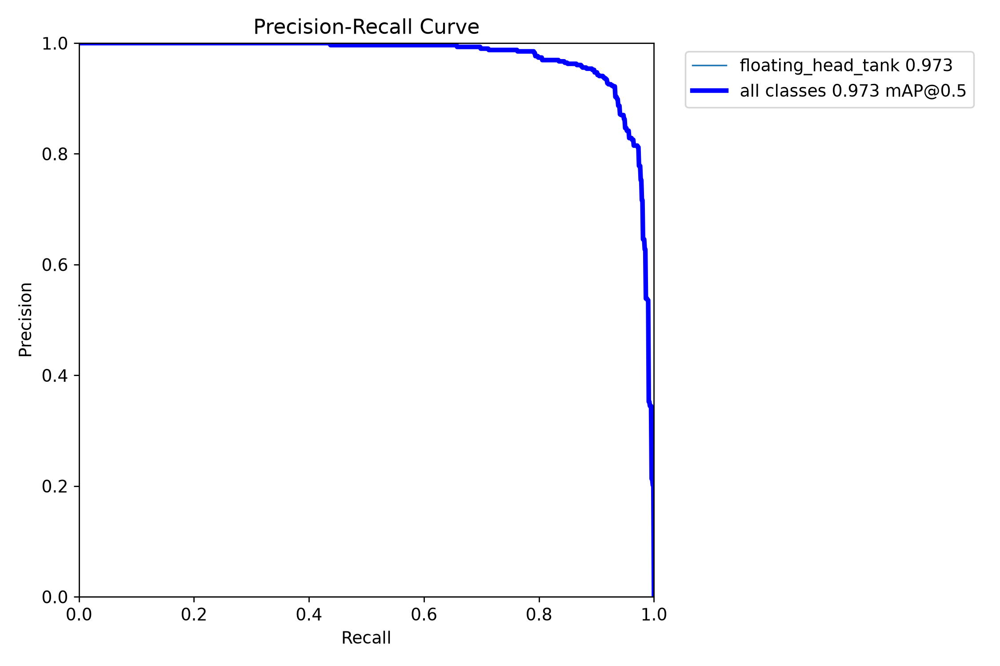
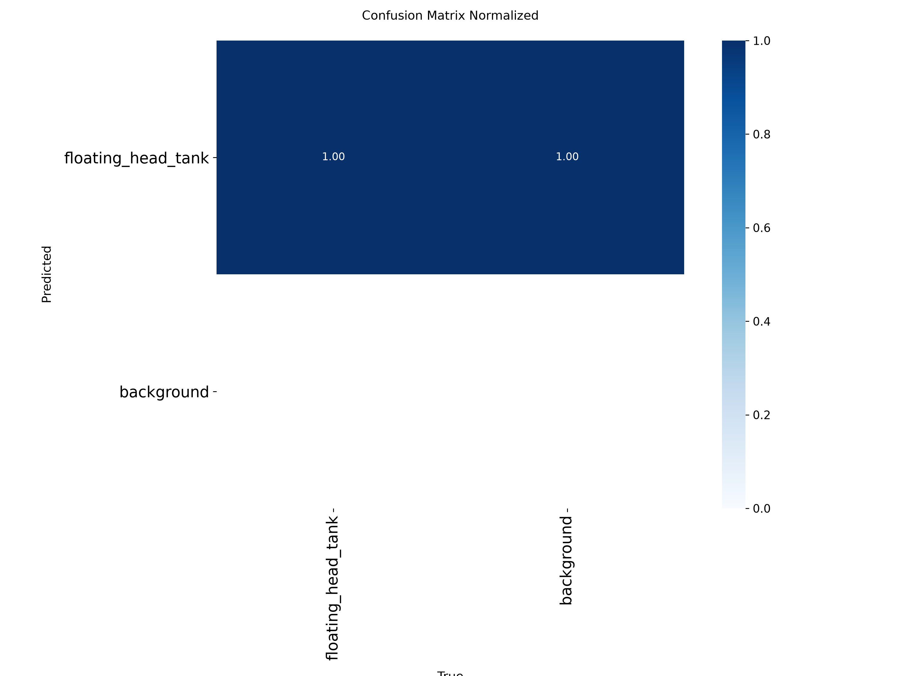
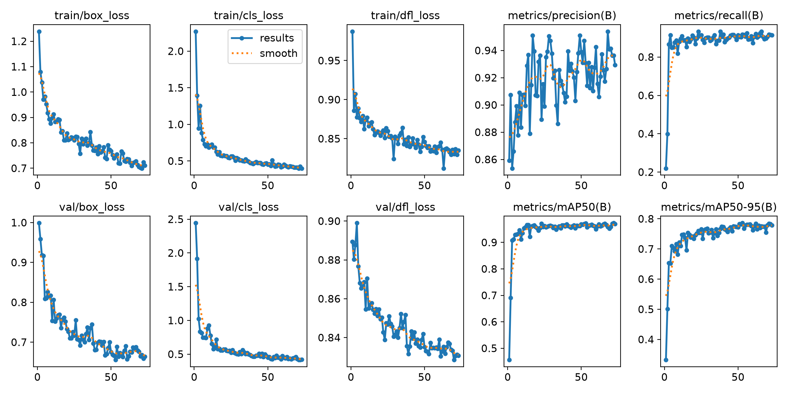

# Barrels.ai: Oil Tank Volume Estimator

  

FuelCast is an end-to-end computer vision application that detects floating-head oil storage tanks from high-resolution satellite imagery and estimates their fill volumes based on shadow analysis.

This project was built to satisfy the growing demand for accurate, transparent measurements of global oil reserves, bypassing the often opaque data provided by institutions and governments. 

**[🚀 View the Live Application](https://barrels-ai-frontend.onrender.com/)**

---

## 🌟 The Application

The application features a decoupled architecture designed for modern deployment:
* **FastAPI Backend:** Hosts the YOLOv8 object detection model and the Numpy/Scikit-Image shadow extraction pipeline.
* **Streamlit Frontend:** A modern, clean web interface for users to upload satellite images, tweak parameters, and view volume estimations in real-time.

  

### How to use:
1. Upload a high-resolution satellite image of an oil refinery (e.g., from Google Earth).
2. Define the average **diameter** and **height** of the tanks in the area.
3. FuelCast will automatically detect all floating-head tanks and extract their crescent shadows.
4. The system calculates the estimated volume (in barrels) by multiplying the physical dimensions by the fill percentage returned by the shadow extraction algorithm.

---

## 📊 Model Training & Analysis

The object detection model is powered by **YOLOv8**, trained specifically to detect floating-head tanks, fixed-roof tanks, and tank clusters. By differentiating these classes, we ensure volume is only estimated on the appropriate floating-head structures.

Below are the key analysis results from the model training process:

### Validation Predictions
A sample of predictions on the validation set, demonstrating the model's accuracy in drawing bounding boxes and assigning correct class labels.

  

### Precision-Recall (PR) Curve
The PR curve shows the tradeoff between precision and recall for different threshold settings, indicating strong performance across all classes.

  

### Confusion Matrix
The confusion matrix illustrates the model's high true positive rates and highlights where false positives/negatives occur across the three tank classes and background.

  

### Training Results
Comprehensive training graphs showing the reduction in loss and the steady increase in mAP (mean Average Precision) over the epochs.

  

---

## 🧠 How it Works

The pipeline is divided into three distinct stages:

### 1. Object Detection (YOLOv8)
Floating-head tanks are essential for volume estimation because their roofs float directly on the oil, casting shadows on the inner walls. Fixed-roof tanks and tank clusters cannot be measured this way. We use a custom-trained **YOLOv8** model to accurately detect and classify floating-head tanks, distinguishing them from other structures.

### 2. Shadow Extraction Algorithm
Detected tanks are passed through a computer vision pipeline to extract the crescent shadows. 
* **Color Space Enhancement:** The image is converted into HSV and LAB color spaces. We apply the ratio `−(L1+L3)/(V+1)` to significantly enhance the visibility of shadows compared to traditional RGB.
* **Thresholding:** We use Otsu thresholding to segment the image, replacing pixels with black/white based on intensity to isolate the shadow regions.
* **Morphological Operations:** To clean up the image (e.g., removing noise from white pipes or surrounding structures), we apply Hessian filters, Clear Border, Morphological Closing, and Area Closing.

### 3. Volume Estimation
The bounding box of the extracted shadow features must intersect the bounding box of the detected tank. 
Volume is estimated as `1 - (inner_shadow_area / outer_shadow_area)`.
The larger area corresponds to the exterior shadow of the tank, while the smaller area corresponds to the interior shadow. The fill percentage is then converted to standard barrels using the user-provided physical dimensions.

---

## 🌍 The Importance of Oil Estimation

Oil powers the global economy. Because commodities must be transported, and most transportation relies on oil, every commodity price is ultimately dependent on oil availability. 

Historically, oil production and storage data have been heavily guarded state secrets. Various nations and cartels attempt to fix oil prices to meet their geopolitical needs, leading to international conflicts. Satellite imagery provides a way to monitor oil storage tanks globally to bring transparency to the market. FuelCast brings this powerful capability into a simple, accessible application.

---

## 🔮 Future Work

In the future, the **Hough Transform** can be tested to automatically detect the radius of the tank's top directly from the image, eliminating the need for manual user input. Additionally, combining texture characteristics with the current color-space thresholds will help extract tank shadows from a larger variety of challenging lighting conditions and satellite angles.
